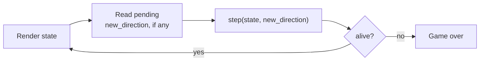

# Snake — Game Loop & Presentation Spec

## Overview

This document covers the runtime layer of the Snake game, built on top of the World Model and Step Function defined in `spec-step.md`:

1. **Game Loop** — keeps time, calls the step function, and passes state/events between it and the presentation layer.
2. **Presentation Layer** — renders the world model and translates player input into world model events. This layer is platform-specific: the same world model and step function can be paired with a presentation layer generated for a different platform (e.g. HTML5 canvas/DOM in a browser, or PPU tiles and controller input on an NES), as long as it satisfies the spec below.

---

## Game Loop

### Behavior

The game loop is the conductor: it ticks at a fixed interval, shows the presentation layer the current state, and calls the step function with whatever directional input has arrived from the presentation layer since the last tick (or none, if no new direction has arrived). It also decides when the game has ended.

Direction handling itself — whether a new_direction is applied, ignored, or overrides the current direction — is `step()`'s concern, per `spec-step.md`, not the game loop's.

### Spec

Runs on a fixed tick interval (interval value TBD):

1. Pass the current game state to the presentation layer for rendering.
2. Determine `new_direction`: the most recent directional input event from the presentation layer since the last tick, or `null`/empty if none arrived.
3. Call `step(state, new_direction)` to produce the next state, after a fixed per-tick delay.
4. Repeat, stopping (or entering a "game over" mode) once `alive` is `false`.

---

## Presentation and Rendering Layer

### Behavior

Renders the world model to the screen each tick and translates player input into directional events for the game loop. This is a platform-specific layer — each implementation (HTML5 canvas, HTML5 DOM, NES, or any future target) builds its own, driven by whatever rendering and input primitives that platform provides.

### Spec

*Not yet specified in a platform-agnostic way.* At minimum any presentation layer will need to:

- Render the grid, walls, snake body, and head from the world model on each tick.
- Display the current `score`, updating it each tick.
- Capture directional input (e.g. arrow-key/WASD keydown events in a browser, D-pad reads on an NES controller) and forward it to the game loop as directional events.
- Render a game-over state when `alive` becomes `false`.

This is a stub and needs to be fleshed out per platform (canvas vs. DOM vs. PPU tiles, styling, input handling details, etc.).
